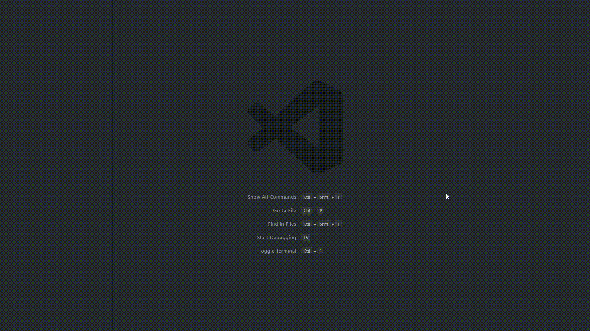

# Terminal Auto Rename

Automatically renames the terminal with the current folder name.

## Release Notes

Users appreciate release notes as you update your extension.

### 1.0.0

Initial release of Terminal Auto Rename.